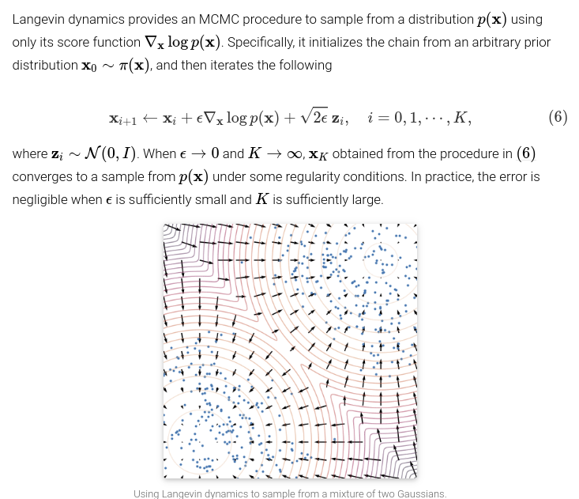

# stochastic gradient langevin dynamics

implementation of the following with torch.

Unindent line 303 of `gym/wrappers/monitoring/video_recorder.py`. 

[Reference](https://yang-song.github.io/blog/2021/score/)

